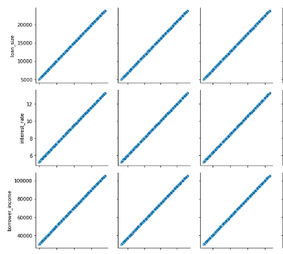
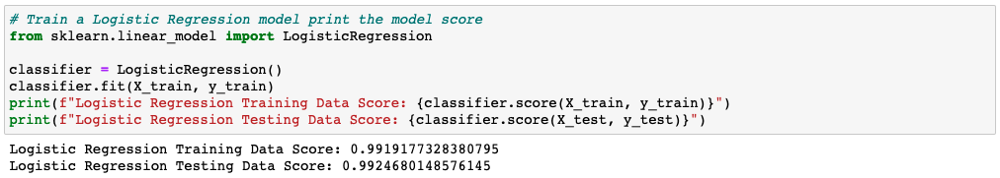
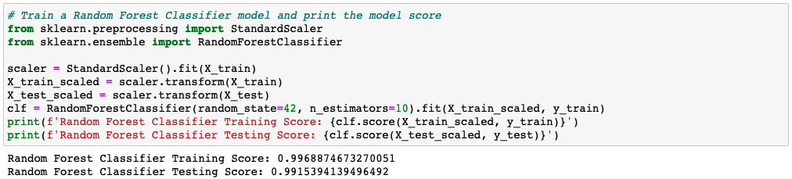

# Credit Risk Predictor

Prepared by Corey Lawson-Enos

## Summary
* A comparison of machine learning models in scikit-learn that attempt to predict whether a loan will be approved or not. Study: Will LogisticRegression or RandomForestClassifier work better?

## Technologies
Tableau, Pandas

## Access
* Data source: 'lending_data.csv' file saved to Resources folder in this repository. 
* Use 'Credit Risk Evaluator.ipynb' Jupyter Notebook in this respository to recreate study.

## Prediction
* The dataset is imbalanced, which should impact both models. However, the scatter plot matrix generated before testing (partial snapshot below) shows widespread linear relationships. For this reason, logistic regression is expected to outperform the random forests classifier since it is a linear model.

## Test Results
* Scores:
- Logistic Regression: 0.9924680148576145
- Random Forest Classifier: 0.9915394139496492

Although both models performed well, Logistic Regression did perform slightly better as predicted--but only to the thousandth degree of accuracy.

## Source

* Loan Approval Dataset (2022). Data generated by Trilogy Education Services, a 2U, Inc.

## Contact
E-mail: clawson131@gmail.com 
LinkedIn: https://www.linkedin.com/in/corey-lawson-enos/
